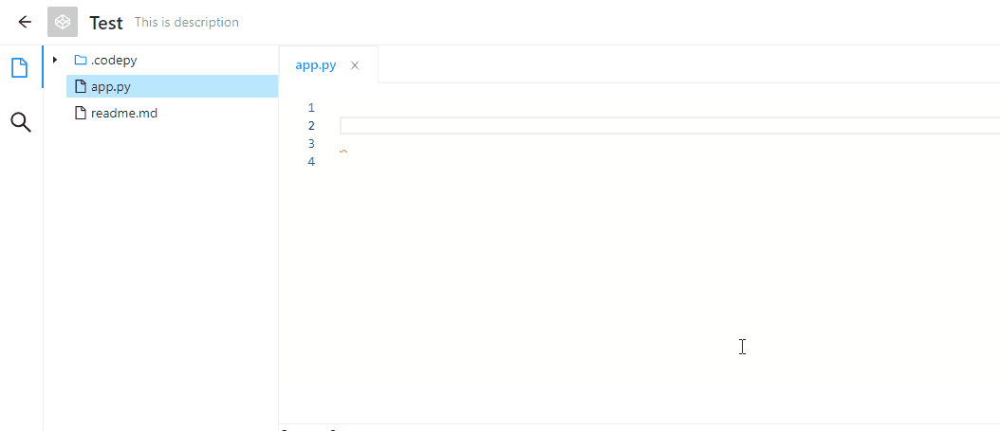

# Code.py
A python web editor base on Monaco-Editor.



## 后端

后端使用 python3.6 开发，使用 `flask` 作为微服务框架。

```
$ cd codepy-server
$ pip3 install -r requriements.txt
$ python3 ./src/main.py
```

## 前端

前端使用 Angular10 开发。
```
$ cd codepy-web
$ yarn
$ yarn start
```


